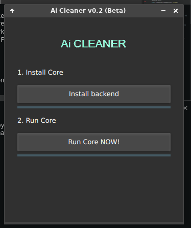

# AiCleaner GUI

<br />
<p align="center">
  <a href="#">
    
  </a>
  <h3 align="center">VoiceCleaner GUI<br>
  Graphic User Inteface of Audio denoising real-time powered by artificial intelligence (Beta)</h3>
</p>

>Name of the project may change on future. 
>Old-name: AiCleaner GUI
<hr style="height:2px;border-width:0;color:gray;background-color:gray">


## Requirements:

- Python 3.8.1+ as default (In the future will be automatic)
- PIP3

## Run Ubuntu (dev)

```
sudo apt-get install git python3.8
pip3 install -r requirements.txt
python3 main.py
```

## Known issues:

1. `ImportError: libOpenGL.so.0: cannot open shared object file: No such file or directory`

`sudo apt install libopengl0 -y #https://stackoverflow.com/a/65751558/10491422`


## Contributions

Please feel free to contribute. c:

- GUI Template: [Wanderson-Magalhaes](https://github.com/Wanderson-Magalhaes/Login_With_PySide6_And_VSCode)


### Roadmap

Check the [CORE ROADMAP](https://github.com/DZDL/aicleaner/blob/main/ROADMAP.md).

### License

This open-source repository is under MIT license, check full [here](LICENSE.md).
